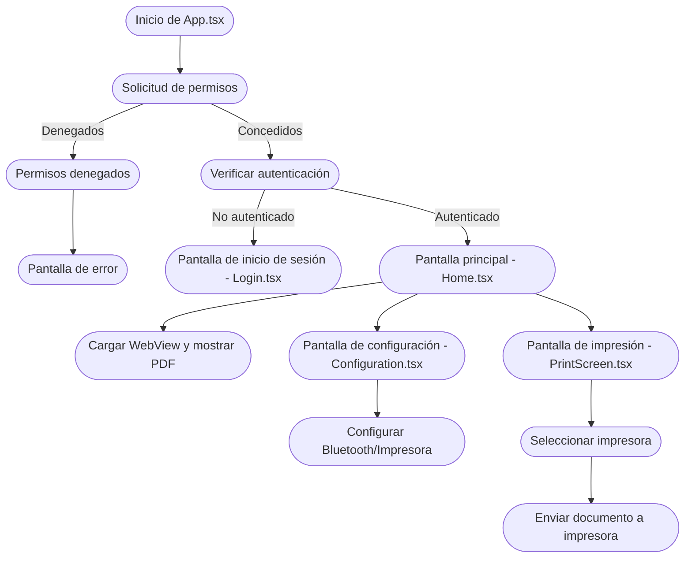

```mermaid
flowchart TD
  start([Inicio de App.tsx])
  permisos([Solicitud de permisos])
  permisos_denegados([Permisos denegados])
  error([Pantalla de error])
  autenticacion([Verificar autenticación])
  no_autenticado([Pantalla de inicio de sesión - Login.tsx])
  autenticado([Pantalla principal - Home.tsx])
  webview([Cargar WebView y mostrar PDF])
  configuracion([Pantalla de configuración - Configuration.tsx])
  bluetooth([Configurar Bluetooth/Impresora])
  imprimir([Pantalla de impresión - PrintScreen.tsx])
  seleccionar_impresora([Seleccionar impresora])
  enviar_doc([Enviar documento a impresora])

  %% Conexiones del flujo
  start --> permisos
  permisos --> |Concedidos| autenticacion
  permisos --> |Denegados| permisos_denegados
  permisos_denegados --> error
  autenticacion --> |No autenticado| no_autenticado
  autenticacion --> |Autenticado| autenticado

  %% Flujo desde la pantalla principal
  autenticado --> webview
  autenticado --> configuracion
  autenticado --> imprimir

  %% Configuración
  configuracion --> bluetooth

  %% Impresión
  imprimir --> seleccionar_impresora
  seleccionar_impresora --> enviar_doc
```